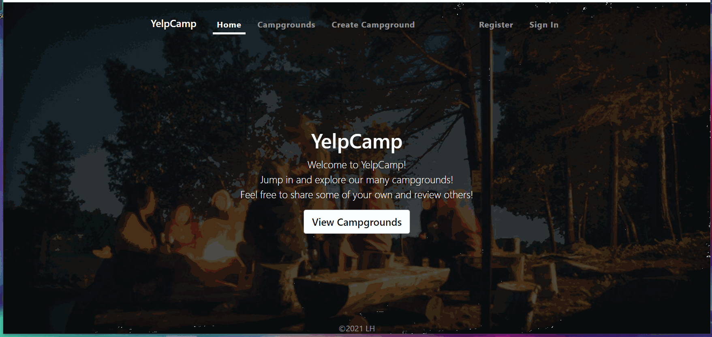

# YelpCamp

You can visit the site [here!](https://ycamplh.herokuapp.com)

A fully responsive full stack web application built using Node.js, Express, and MongoDB Atlas. 
A dummy campground review website that uses authentication and validation for users and forms. 

Users can register and log in to create new campgrounds, review other campgrounds, or just peruse the site.

API Mapbox GL JS integration for full size cluster map, as well as smaller point-focused maps for each individual campground.

Mobile-friendly! While they are show here, maps will not show up on screen sizes smaller than 480px.

